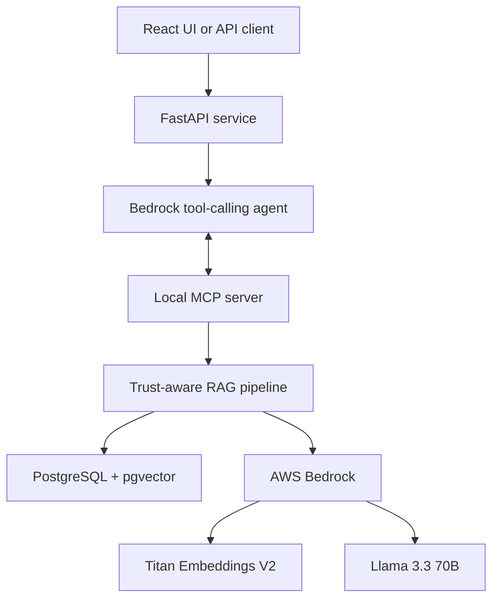
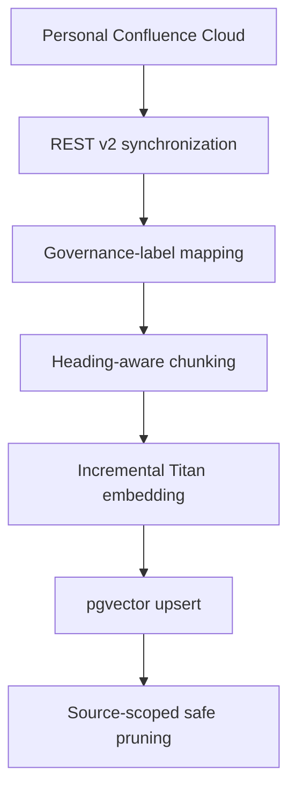

# Meridian Confluence Agent Architecture

## Purpose

Meridian demonstrates a production-minded enterprise knowledge assistant. It
combines semantic retrieval with explicit documentation governance so a highly
similar but superseded page does not outrank the canonical procedure.

## Runtime architecture

FastAPI and the MCP server run in the same container. FastAPI starts MCP as a
stdio subprocess and reuses the connection across requests. PostgreSQL remains
a separate stateful service.

## Knowledge refresh path

The refresh selects explicitly governed pages and excludes unlabeled templates.
SHA-256 fingerprints prevent unnecessary embedding calls. Pruning is restricted
to rows whose metadata source is `confluence_cloud`; frozen evaluation records
cannot be deleted by the refresh job.

## Trust policy

- Canonical and current procedures receive bounded positive adjustments.
- Draft, under-review, deprecated, and superseded pages are demoted.
- Conflicting evidence remains visible as a warning instead of being hidden.
- Raw semantic similarity must pass the confidence gate before generation.
- The LLM receives recommended and conflicting evidence in separate prompt
  sections and must cite the supplied source IDs.

## Credential boundaries

- `.env` is excluded from Git and Docker build context.
- The image contains no AWS or Atlassian credentials.
- Local Docker mounts the developer's `.aws` directory read-only.
- AWS deployment should remove that mount and use an ECS task role for Bedrock.
- Confluence credentials should be injected from AWS Secrets Manager or SSM,
  not committed or stored in the container image.

## AWS deployment target

The recommended portfolio deployment is an Application Load Balancer in front
of an ECS Fargate service, with Aurora PostgreSQL/pgvector or RDS PostgreSQL for
state. ECR stores the backend image. CloudWatch receives container logs, while
IAM limits the task to the required Bedrock model-invocation permissions.
